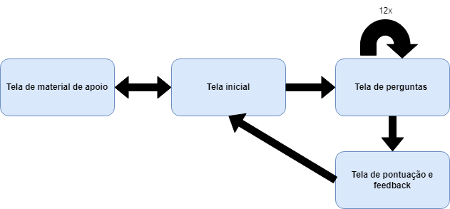

# NoSQL Quiz

----

Repositório do projeto NoSQL Quiz, um quiz game que teste os conhecimentos do usário sobre bancos de dados NoSQL. 
Além de testar os conhecimentos do usuário em 12 perguntas com 25 segundos para responde-las, é fornecido támbem links de 
apoio para a melhoria e continuidade dos estudos no tema.

Esse aplicativo foi desenvolvido durante a disciplina de Fundamentos de Programação Aplicada, PPGIA-UFRPE.

## Apresentação do aplicativo

- [Vídeo de apresentação da aplicação](https://docs.flutter.dev/get-started/codelab)
- [Demonstração da utilização](https://docs.flutter.dev/cookbook)

## Disponibilização do aplicativo

- [Android](https://docs.flutter.dev/cookbook)

## Diagrama de Navegação 

## Árvore de Widget

<h3>Tela Principal</h3>

|                          Tela                          |                     Diagrama                     |
|:------------------------------------------------------:|:------------------------------------------------:|
|  |  |

## Protótipo da Aplicação

- [Figma](https://www.figma.com/file/XaBg7WL8V7OvNwARrYgiU2/NoSQL-Quiz?type=design&node-id=0%3A1&mode=design&t=8shjS1L0hd6CDjt7-1)
